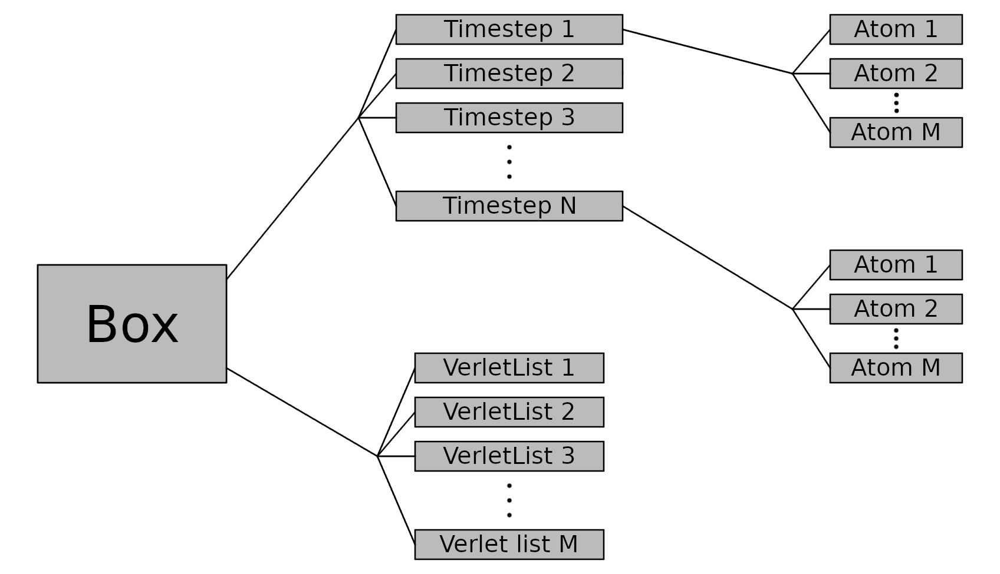

# Descriptors for Kabuto project

## About

Developed by Ondrej Bily, Faculty of Mathematics, Physics and Informatics, Comenius University in Bratislava, Slovakia.

It is a C++ extension for Python used in the [Kabuto](https://github.com/ondrej17/kabuto) project. The main purpose of the library is to calculate "descriptors" for each atom in the system at each timestep. Descriptors, in our case, is a set of 14 values calculated using various functions (Behler-Parinello symmetry function G2 and G3, and Steinhardt parameters with l = 6, 7, and 8). 

The whole library is also my project for the subject "Programovanie (3)" at the university. Since TDD (test-driven development) is the main focus of the course, the whole library is tested using `GoogleTest` testing framework.

## Visualisation of object relationship in `descriptors` library

## Project structure

* `src`
  * `boost`
    * `...`
  * `common`
    * `images`
      * `object-relationship.png`
  * `descriptors_atom.cpp`
  * `descriptors_atom.h`
  * `descriptors_box.cpp`
  * `descriptors_box.h`
  * `descriptors_descriptors.cpp`
  * `descriptors_descriptors.h`
  * `descriptors_module.cpp`
  * `descriptors_module.h`
  * `descriptors_timestep.cpp`
  * `descriptors_timestep.h`
  * `descriptors_utility.cpp`
  * `descriptors_utility.h`
  * `descriptors_verlet_list.cpp`
  * `descriptors_verlet_list.h`
* `tests`
  * `GoogleTest`
    * `...`
  * `gtest`
    * `...`
  * `CMakeLists.txt`
  * `test_atom.cpp`
  * `test_box.cpp`
  * `test_descriptors.cpp`
  * `test_timestep.cpp`
  * `test_verlet_list.cpp`
* `install.sh`
* `setup.py`
* `README.md`

## Building and installing

### Building `boost` library

No building is needed, all header files are already included (`src/boost`).

### Building `googletest` framework

No building is needed, all header files are already included (`tests/gtest` and `tests/GoogleTest`).

### Building tests

    cd tests 
    mkdir build
    cd build
    cmake ..
    make 

### Installing `descriptors` library

    (sudo) ./install.sh
     
## Usage

Run tests using this (in `tests/build`):

    ./descriptors

Use `descriptors` extension in your Python project using this:

    import descriptors
    ...
    descriptors.compute(pbcX, pbcY, pbcZ, timesteps)